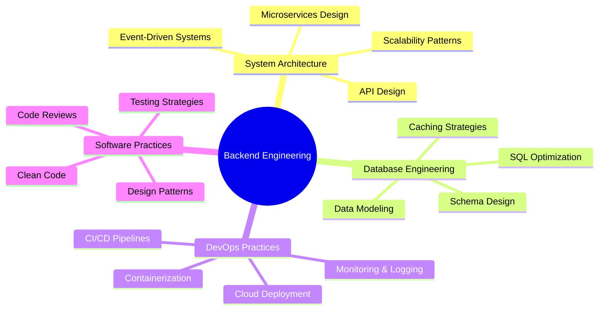

<div align="center">
  
# 👋 Hello, I'm Habib Huseynov

### Software Engineer | Backend Architect | Cloud Solutions Specialist

[](https://www.linkedin.com/in/habib-huseynov/)
[](mailto:your-email@example.com)
[](https://github.com/HabibHuseynov)

</div>

---

## 🚀 About Me

I'm a passionate **Backend Software Engineer** based in **Azerbaijan**, specializing in building **scalable, high-performance distributed systems**. With expertise spanning multiple technology stacks, I focus on architecting robust backend solutions, optimizing database performance, and implementing cloud-native microservices architectures.

```typescript
const habib = {
    location: "Baku, Azerbaijan",
    currentFocus: ["Microservices Architecture", "System Design", "Cloud Native Apps"],
    technologies: {
        languages: ["Java", "C#", "Python"],
        frameworks: ["Spring Boot", ".NET Core", "Spring Cloud"],
        databases: ["PostgreSQL", "MySQL", "Redis"],
        messageQueues: ["RabbitMQ", "Apache Kafka"],
        tools: ["Docker", "Git", "Maven", "Gradle"]
    },
    architecture: ["Event-Driven", "CQRS", "RESTful APIs", "Microservices"],
    currentlyLearning: ["Kubernetes", "Cloud Architecture Patterns", "System Design at Scale"]
};
```

---

## 💻 Technology Stack

<div align="center">

### Languages & Frameworks


### Databases & Caching


### Message Brokers & Streaming


### DevOps & Tools


</div>

---

## 🎯 Core Competencies



---

## 🔥 What I'm Currently Working On

- 🏗️ Designing and implementing **microservices architectures** with Spring Boot
- 🔄 Building **event-driven systems** using RabbitMQ and Kafka
- ⚡ Optimizing **database performance** and implementing efficient caching strategies
- 🐳 Containerizing applications with **Docker** for cloud-native deployments
- 📚 Exploring **distributed systems** patterns and **system design** principles

---

## 📊 GitHub Statistics

<div align="center">
  
  
</div>

<div align="center">
  
  
</div>

---

## 🏆 Featured Projects

> Coming soon! I'm working on publishing some exciting open-source projects. Stay tuned!

<!-- 
Uncomment and fill in when you have projects to showcase:

### 🎯 [Project Name](https://github.com/HabibHuseynov/project-name)
Brief description of what this project does and the technologies used.
- **Tech Stack:** Spring Boot, PostgreSQL, Redis, Docker
- **Highlights:** High-performance API, Microservices architecture, Event-driven design

### 🚀 [Another Project](https://github.com/HabibHuseynov/another-project)
Description of another cool project you've built.
- **Tech Stack:** .NET Core, SQL Server, RabbitMQ
- **Highlights:** Real-time processing, CQRS pattern, Cloud-ready
-->

---

## 📈 Professional Focus Areas

<table align="center">
<tr>
<td align="center" width="33%">

### 🏗️ Backend Architecture
Building scalable, maintainable systems with clean architecture principles and SOLID design patterns.

</td>
<td align="center" width="33%">

### 🔄 Microservices
Designing distributed systems with proper service boundaries, communication patterns, and data consistency.

</td>
<td align="center" width="33%">

### ⚡ Performance
Optimizing application performance through efficient algorithms, caching strategies, and database tuning.

</td>
</tr>
</table>

---

## 🌱 Currently Learning

- **Kubernetes & Container Orchestration** - Scaling containerized applications
- **System Design** - Designing large-scale distributed systems
- **Cloud Architecture** - AWS/Azure cloud-native patterns
- **Advanced Database Optimization** - Query tuning and performance engineering

---

## 💡 Engineering Principles I Follow

```yaml
philosophy:
  - "Clean code is not written by following a set of rules, but by caring deeply about the craft"
  - "Make it work, make it right, make it fast - in that order"
  - "Simplicity is the ultimate sophistication"
  - "Premature optimization is the root of all evil"
  
practices:
  - Write self-documenting code with meaningful names
  - Test-driven development for critical business logic
  - Continuous learning and knowledge sharing
  - Code reviews as a learning opportunity
```

---

## 📫 Let's Connect!

<div align="center">

I'm always interested in discussing **backend architecture**, **system design**, and **software engineering best practices**. 

Whether you want to collaborate on a project, discuss technology, or just say hi, feel free to reach out!

[](https://www.linkedin.com/in/habib-huseynov/)
[](mailto:your-email@example.com)

---


**⭐ If you find my work interesting, consider giving a star to my repositories!**

</div>

---

<div align="center">
  <sub>Built with ❤️ and ☕ by Habib Huseynov</sub>
</div>
